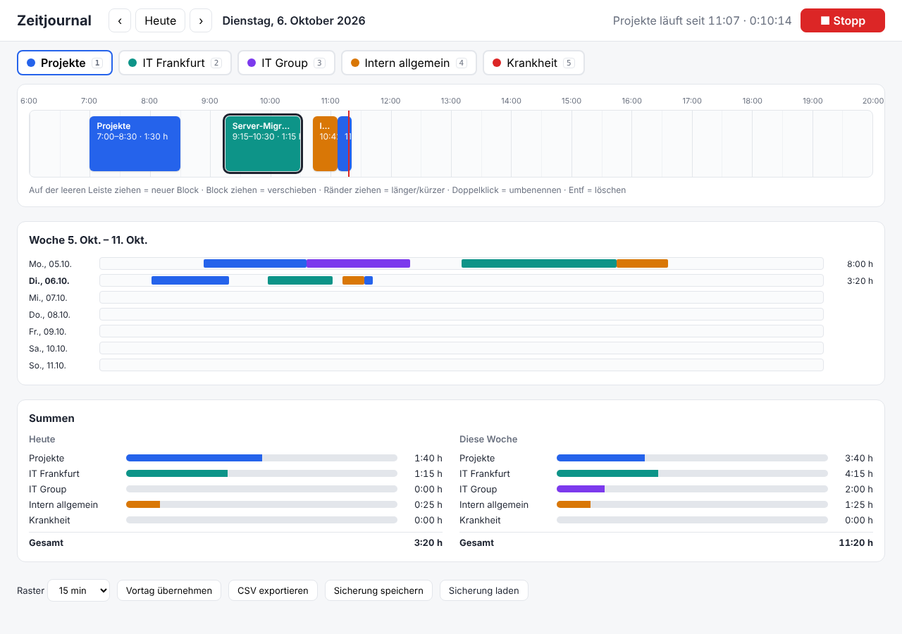
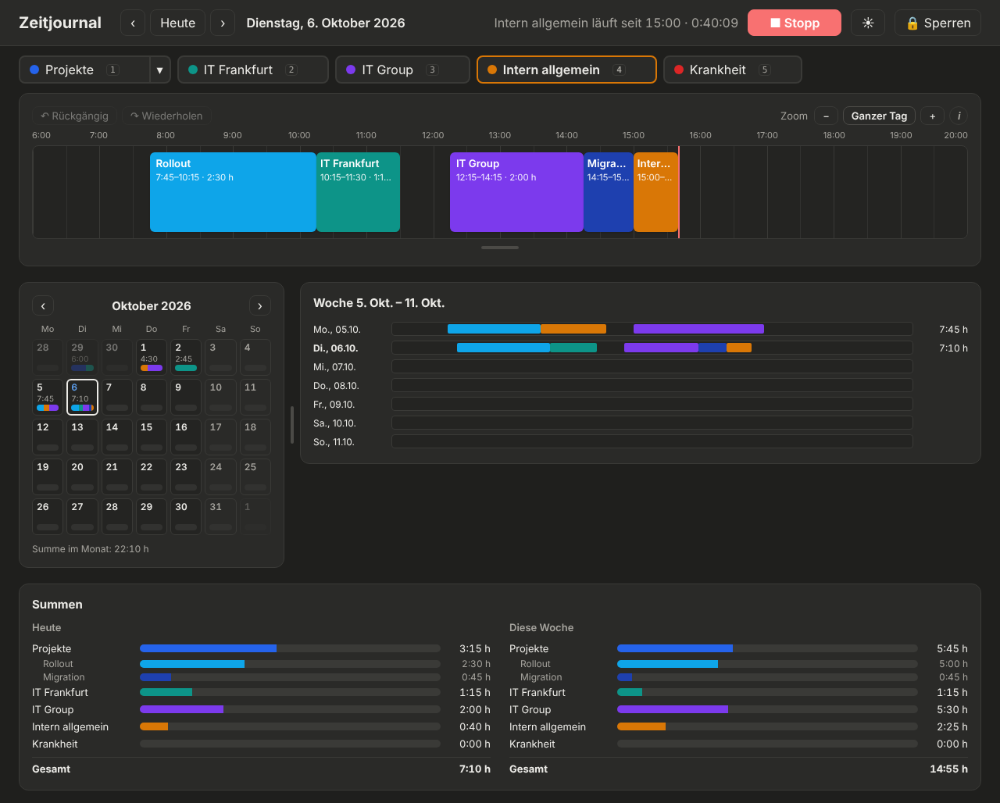
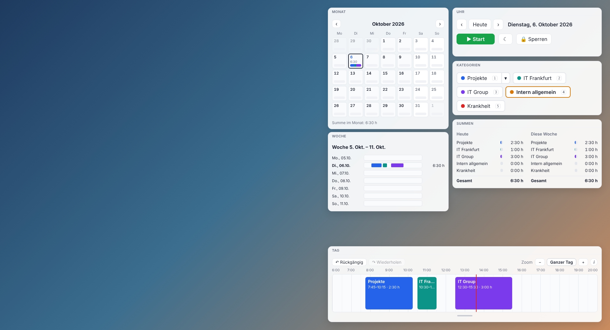

# Zeitjournal

Grafisches Zeitjournal: Zeiten als farbige Blöcke auf einer Tagesleiste erfassen, mit der Maus verschieben, verlängern, kürzen und benennen.

Online: https://matthiassuetterlin.github.io/Zeitjournal/

## Benutzen

`index.html` im Browser öffnen, fertig. Beim ersten Öffnen legst du ein Passwort fest; danach fragt die App bei jedem Öffnen danach. Es gibt keinen Server: die Daten bleiben im Browser (localStorage). Über „Sicherung speichern/laden“ lassen sie sich als Datei sichern oder auf einen anderen Rechner mitnehmen. Mit GitHub Pages läuft die App direkt aus dem Repo.

| Was | Wie |
| --- | --- |
| Block anlegen | Auf der leeren Leiste ziehen, oder klicken (1 Stunde) |
| Verschieben | Block ziehen (springt nicht über andere Blöcke, sondern in die nächste freie Lücke) |
| Länger/kürzer | Linken oder rechten Rand ziehen; der Nachbarblock wird dabei automatisch kürzer, liegen zwei Blöcke aneinander, wandert die gemeinsame Grenze |
| Umbenennen | Doppelklick oder Enter |
| Kategorie ändern | Block anklicken, dann Kategorie oder Taste 1–5 |
| Projekt wählen | Pfeil ▾ neben „Projekte“: Projekt auswählen, neu anlegen (Enter), umbenennen ✎ oder löschen ✕ |
| Hell/Dunkel | ☾/☀ oben rechts (startet passend zur Systemeinstellung) |
| Löschen | Block anklicken, Entf |
| Stoppuhr | Start/Stopp oder Leertaste; Kategorie wechseln, während sie läuft, schließt den Block und beginnt einen neuen |
| Zoom | + / − oben an der Zeitleiste, Strg+Mausrad oder Tasten +/−; „Ganzer Tag“ zeigt wieder alles |
| Bereiche größer ziehen | Griff unter der Zeitleiste nach unten ziehen; Trenner zwischen Monat und Woche seitlich ziehen; Doppelklick setzt zurück |
| Rückgängig / Wiederholen | Knöpfe über der Zeitleiste, oder Strg+Z und Strg+Umschalt+Z |
| Hilfe | Das i-Symbol über der Zeitleiste zeigt beim Darüberfahren, wie alles funktioniert |
| Tage wechseln | ← / → / T, oder in der Monats- oder Wochenübersicht auf einen Tag klicken |
| Monatsübersicht | Jeder Tag zeigt Stunden und einen Farbstreifen, was gearbeitet wurde; ‹ › blättert die Monate |

## Windows-Desktop-Version

Das Zeitjournal gibt es auch als Desktop-Programm für Windows. Es liegt durchsichtig über dem Desktop, sichtbar sind nur die einzelnen Kacheln (Uhr, Kategorien, Tag, Woche, Monat, Summen).

- **Installieren:** unter [Releases](https://github.com/matthiassuetterlin/Zeitjournal/releases) die neueste `Zeitjournal-Setup-….exe` herunterladen und doppelklicken. Weil der Installer nicht signiert ist, warnt Windows beim ersten Mal; dann „Weitere Informationen“ und „Trotzdem ausführen“ wählen.
- **Kacheln anordnen:** an der Titelleiste einer Kachel ziehen. Am rechten Rand ziehen macht sie breiter oder schmaler. Die Anordnung bleibt gespeichert.
- **Symbol in der Taskleiste** (rechts unten, bei den kleinen Symbolen): Kacheln ein- und ausblenden, neu anordnen, immer im Vordergrund, mit Windows starten, sperren, beenden.
- Klicks auf freie Flächen gehen zum Desktop durch. Das Programm startet automatisch mit Windows (abschaltbar im Menü).
- Die Daten liegen auf dem Rechner und sind mit dem Code verschlüsselt, getrennt von der Webseite.

Selbst bauen: im Ordner `desktop` `npm install` und `npm run dist`. Zum Ausprobieren ohne Installer: `npm start`.

## Code-Sperre

Beim Öffnen fragt das Zeitjournal nach einem 4-stelligen Code, eingegeben über ein Ziffernfeld wie beim Telefon (Maus, Finger oder Zifferntasten). Die Zeiten werden mit dem Code verschlüsselt (AES-GCM, Schlüssel per PBKDF2) im Browser gespeichert und nie an einen Server geschickt. Nach drei falschen Codes muss man 30 Sekunden warten, danach jeweils doppelt so lange.

Ein 4-stelliger Code schützt vor neugierigen Blicken, aber nicht vor jemandem, der den Rechner in die Hand bekommt und gezielt alle 10.000 Codes durchprobiert. Ohne Code sind die Daten verloren; „Code vergessen?“ löscht sie und beginnt neu. Eine gespeicherte Sicherung (JSON) ist nicht verschlüsselt.
